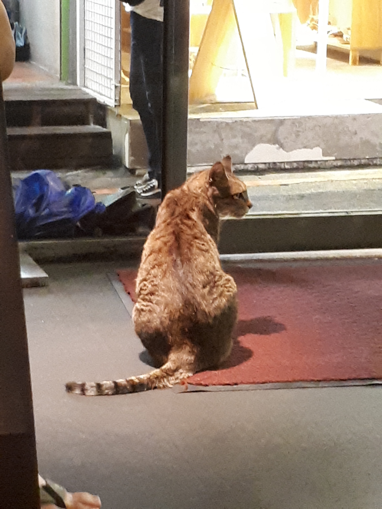

# Vision API

This is an API that given a picture and it returns objects labels, positions, and confidences.

## Getting started

```
sh build.sh
export FLASK_APP=api.py
flask run
```


## Example

Input:



Output:

```
[{'bottomright': {'x': 1846, 'y': 1890},
  'confidence': 0.51838398,
  'label': 'person',
  'topleft': {'x': 988, 'y': 85}},
 {'bottomright': {'x': 2311, 'y': 3372},
  'confidence': 0.60397381,
  'label': 'cat',
  'topleft': {'x': 1135, 'y': 1512}}]
```

## TODO

- [ ] Get dockerized
- [ ] Example case and testing
- [ ] API request sample